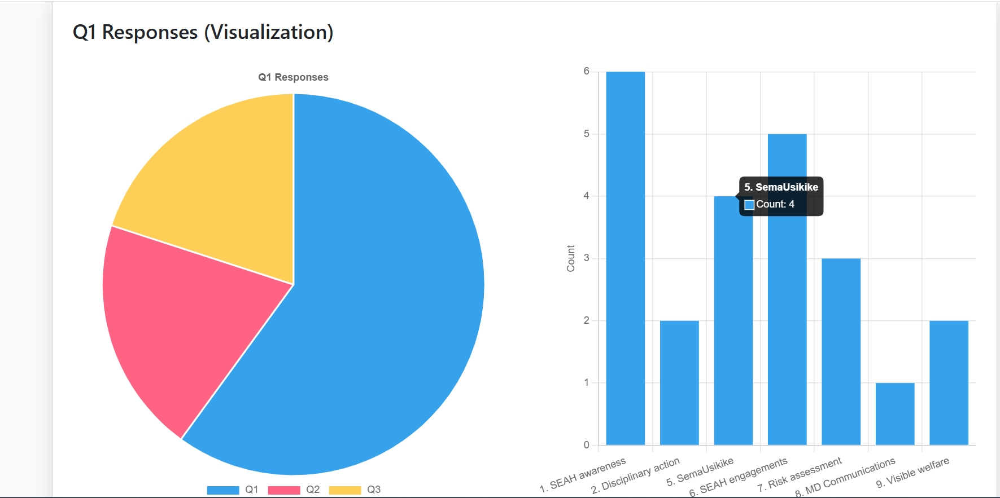

# 📊 Survey Visualization Dashboard
## Overview

Welcome to the **Survey Visualization Dashboard**, a web application designed to upload, analyze, and visualize survey data with interactive filtering capabilities. Built as an entry-level project, this dashboard allows users to upload Excel files containing survey responses, visualize Q1 response trends (e.g., awareness categories) using charts, and filter data by sex for deeper insights. The project showcases full-stack development skills with Flask, MySQL, and Chart.js, deployed on GitHub for version control and potential collaboration.

### Project Demo
<!-- *(Add a live link if deployed, e.g., [Live Demo](https://your-app.herokuapp.com/) or a screenshot)* ?  -->
 
 

## Features
- **File Upload**: Upload survey data from Excel files and store it in a MySQL database.
- **Data Visualization**: Display Q1 responses in pie and bar charts for distribution and counts.
- **Dynamic Filtering**: Filter Q1 data by sex (Male/Female/All) with real-time chart updates.
- **Data Download**: Export filtered data to an Excel file with highlighted duplicates.
- **Responsive Design**: User-friendly interface built with Bootstrap.

## Technologies Used
- **Backend**: Python, Flask
- **Database**: MySQL
- **Frontend**: HTML, CSS (Bootstrap), JavaScript (Chart.js, jQuery)
- **Version Control**: Git, GitHub
- **Dependencies**: pandas, sqlalchemy, pymysql, xlsxwriter

## Getting Started

### Prerequisites
- Python 3.9+
- MySQL Server
- pip (Python package manager)

### Installation
1. Clone the repository:
   ```bash
   git clone https://github.com/Elisha-3/survey-visualization-dashboard.git
   cd survey-visualization-dashboard

2. Create a virtual environment and activate it
    python -m venv venv
    source venv/bin/activate

3. Install dependancies
    pip install -r requirements.txt

4. Run the application
    python app.py